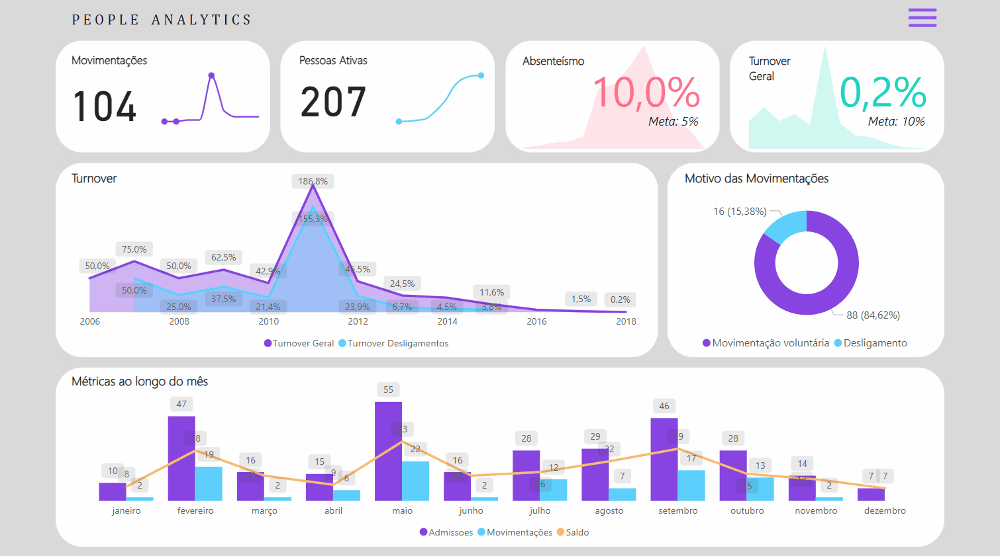

## People Analytics: Análise de Movimentações e Desligamentos

### Visão Geral 
Este projeto de People Analytics tem como objetivo analisar os dados de admissões, movimentações internas, desligamentos voluntários ou demitidos em uma empresa, visando melhorar a gestão de recursos humanos e subsidiar decisões estratégicas.

### Dados Analisados
1. **Admissões:** Registro de novas contratações na empresa.
2. **Movimentações Internas:** Mudanças de cargo, promoções ou transferências de funcionários.
3. **Desligamentos Voluntários ou Demitidos:** Registros de saídas voluntárias e demissões.
4. **Pessoas Empregadas Ativas:** Número atual de funcionários ativos na empresa.

### Análises Realizadas
- **Movimentações de Funcionários:** Análise das mudanças internas de cargo ao longo do tempo.
- **Pessoas Ativas na Empresa:** Acompanhamento do número total de funcionários ativos mensalmente.
- **Abstenção (Absentismo):** Métricas de absenteísmo para avaliar o impacto das faltas no desempenho organizacional.
- **Turnover Geral:** Taxa de turnover para medir a rotatividade de funcionários na empresa.
- **Motivos das Movimentações:** Identificação das principais razões por trás das mudanças de posição ou saídas da empresa.
- **Métricas ao Longo do Mês:** Variação mensal das métricas de movimentações, ativos, abstenção e turnover.

### Resultados da Análise
- Identificação de que mais de 60% das saídas voluntárias foram devido à implementação da nova cultura na empresa.
- A análise revelou que a quantidade significativa de desligamentos foi justificada pela fusão com outra empresa, impactando o ambiente de trabalho.
- Em 2018, houve uma redução nos desligamentos, porém poucas contratações ocorreram devido à falta de demanda de mercado e clientes, refletindo na necessidade reduzida de contratações.

### Conclusão
Este projeto de People Analytics proporciona insights valiosos para a gestão de recursos humanos, ajudando a empresa a entender melhor as dinâmicas internas, melhorar a retenção de talentos e adaptar estratégias de recrutamento e desenvolvimento organizacional.
