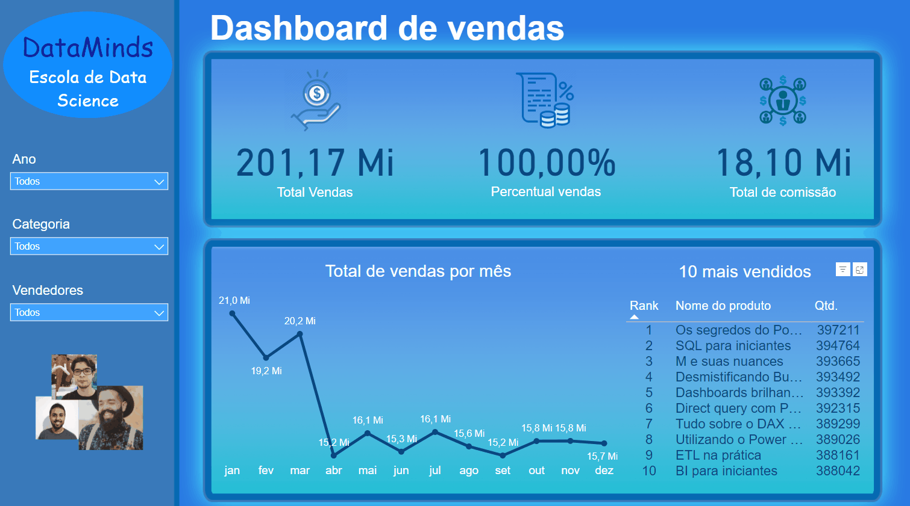

# Projetos de Análise de Dados com Power BI

Este repositório contém uma coleção de projetos de análise de dados desenvolvidos para diferentes contextos e necessidades. Cada projeto utiliza ferramentas como Power BI e outras técnicas de análise para extrair insights valiosos a partir de conjuntos de dados específicos.

## Lista de Projetos

### People Analytics

**Objetivo:** Analisar dados dos funcionários de uma empresa fictícia para melhorar a tomada de decisões relacionadas ao RH e gestão de pessoas.

**Resumo:**
Este projeto visa analisar dados dos funcionários de uma empresa fictícia para otimizar a gestão de recursos humanos, investigando admissões, movimentações internas, desligamentos voluntários ou demitidos, e métricas mensais. Insights revelaram que mudanças culturais e fusões foram motivos principais para desligamentos, enquanto a redução de contratações em 2018 refletiu a falta de demanda do mercado.

  

- **Link para o projeto:** [People Analytics](People-Analytics)

### Super Pets

**Objetivo:** Criar um dashboard para análise das vendas de uma loja de produtos para animais de estimação.

**Resumo:**
O projeto Super Pets concentra-se na criação de um dashboard automatizado para analisar as vendas de uma loja de produtos para animais de estimação. Ele permite a visualização detalhada do faturamento por gênero, período, bairro, produto e marca, oferecendo insights valiosos para ajustar estratégias de marketing e estoque.

  

- **Link para o projeto:** [Super Pets](Super-Pets)

### Clube do Livro

**Objetivo:** Análise das assinaturas feitas no site "Clube do Livro".

**Resumo:**
Neste projeto, um dashboard interativo no Power BI é desenvolvido para analisar assinaturas no site "Clube do Livro". Os dados examinados incluem assinaturas ativas e inativas, valor de vendas comparado com metas e previsões futuras, perfil dos clientes por profissão e idade média, além de um mapa interativo para visualizar a distribuição geográfica dos clientes.

  

- **Link para o projeto:** [Clube do Livro](Clube-do-Livro)

### E-commerce

**Objetivo:** Analisar as compras feitas em e-commerces no Brasil entre janeiro de 2017 e agosto de 2018.

**Resumo:**
O foco deste projeto é analisar dados de compras realizadas em e-commerces no Brasil entre janeiro de 2017 e agosto de 2018. A análise abrange métodos de pagamento utilizados, valores dos produtos comprados e padrões de compra ao longo do tempo, fornecendo insights essenciais para melhorar a eficiência operacional e estratégias de vendas.

  

- **Link para o projeto:** [E-commerce](E-commerce)

### DataMinds

**Objetivo:** Análise das vendas de cursos no projeto DataMinds.

**Resumo:**
O projeto DataMinds consiste na criação de um dashboard no Power BI para analisar as vendas de cursos oferecidos. Os dados analisados incluem total de vendas, percentual de comissão e comissão total gerada, com filtros disponíveis por vendedor, categoria de curso, ano, mês e curso específico, visando otimizar as estratégias de vendas e de comissões na empresa.

  

- **Link para o projeto:** [DataMinds](Data-Minds)
