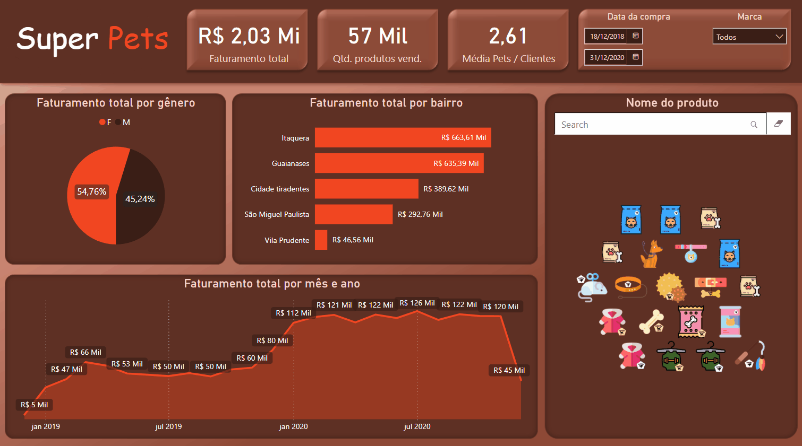

## Dashboard "Super Pets": Análise Automática de Vendas

#### Visão Geral
O projeto "Super Pets" consiste na criação de um dashboard no Power BI que se atualiza automaticamente com base nos dados de vendas de uma loja de produtos para animais de estimação. O objetivo é permitir uma análise detalhada do faturamento da loja, com filtros interativos por gênero do cliente, período de vendas, bairro, produto e marca, proporcionando insights valiosos para otimização de estoque, estratégias de marketing e tomada de decisões comerciais.

#### Dados Analisados

1. **Faturamento**
   - **Descrição:** Visualização do faturamento total da loja ao longo do tempo.
   - **Finalidade:** Monitorar o desempenho financeiro e identificar tendências de crescimento ou declínio.

2. **Filtros Interativos**
   - **Gênero do Cliente:** Permite segmentar as vendas por gênero do cliente.
   - **Período de Vendas:** Filtros para análise por período específico, como mês, trimestre ou ano.
   - **Bairro:** Visualização das vendas por bairro para identificar áreas de maior demanda.
   - **Produto e Marca:** Análise detalhada das vendas por categoria de produto e marca específica.

3. **Análise de Produtos**
   - **Descrição:** Gráficos e tabelas que detalham as vendas por categoria de produtos.
   - **Finalidade:** Identificar quais categorias de produtos são mais populares entre os clientes e ajustar o mix de produtos em estoque.

4. **Desempenho por Marca**
   - **Descrição:** Comparação do desempenho de vendas entre diferentes marcas de produtos.
   - **Finalidade:** Avaliar a aceitação de marcas específicas pelo público-alvo e ajustar estratégias de marketing e promoção.

#### Funcionalidades Adicionais
- **Atualização Automática:** Os dados são atualizados automaticamente para refletir as últimas vendas e informações disponíveis.
- **Visualizações Dinâmicas:** Gráficos interativos que permitem explorar dados com facilidade e precisão.

#### Ferramentas Utilizadas
- **Power BI:** Utilizado para desenvolver o dashboard interativo e aproveitar suas funcionalidades avançadas de visualização e análise de dados.
- **Integração de Dados:** Integração de diferentes fontes de dados para fornecer uma visão unificada e abrangente das vendas.

#### Conclusão
O dashboard "Super Pets" no Power BI oferece uma ferramenta poderosa para análise detalhada das vendas de uma loja de produtos para animais de estimação. Ele permite aos gestores e analistas de negócios obter insights cruciais para impulsionar as vendas, melhorar a gestão de estoque e desenvolver estratégias eficazes de marketing, garantindo um acompanhamento contínuo do desempenho comercial da loja.
